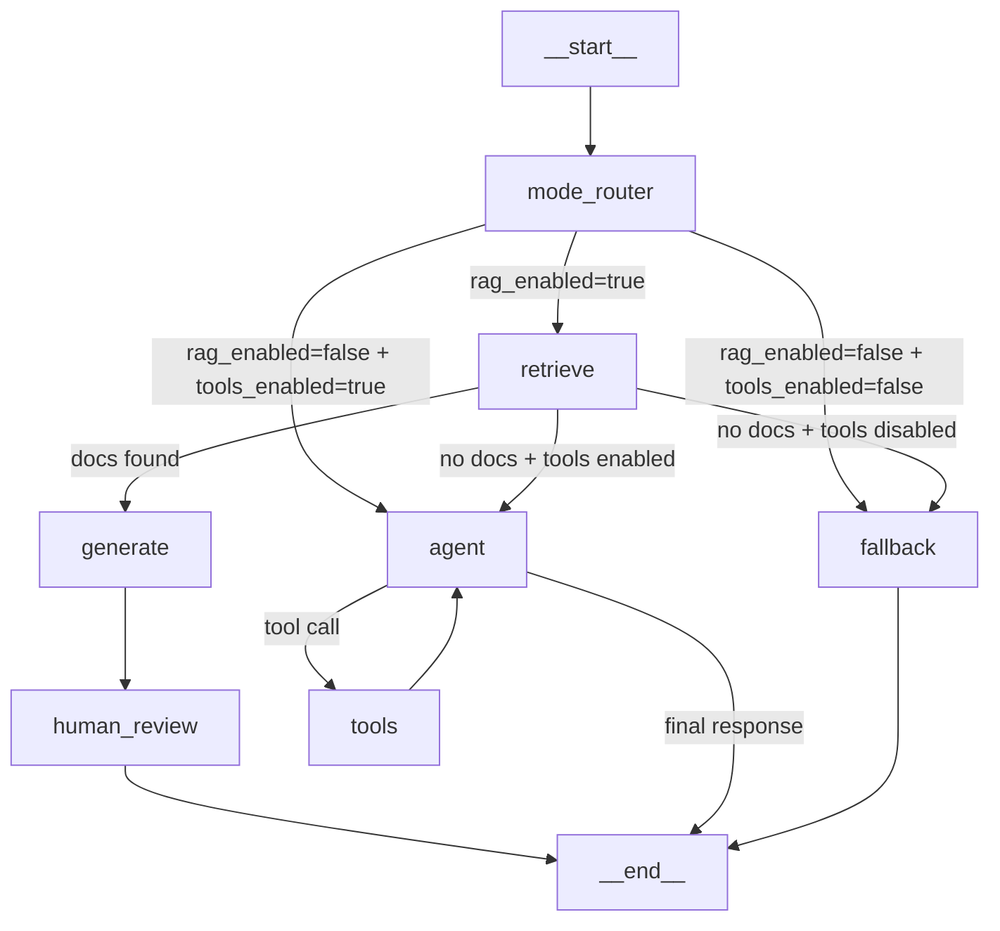
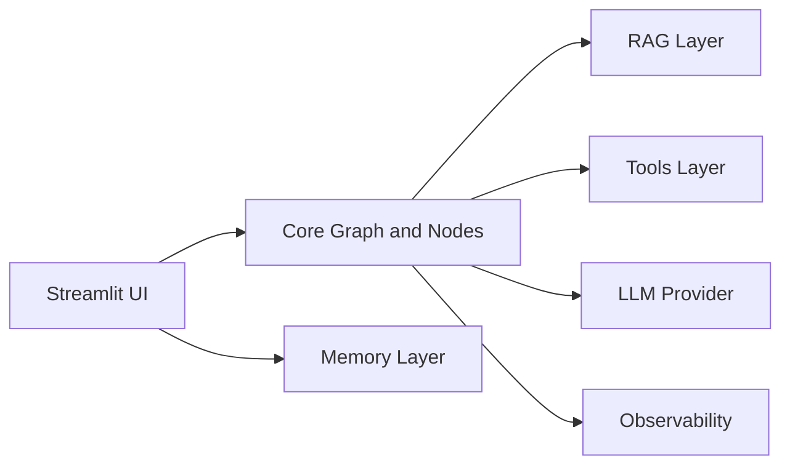

# QA RAG Agent

A learning-friendly Q&A assistant built with LangGraph, LangChain, ChromaDB, and Streamlit.

## Features

- RAG-based answers from indexed documents
- Optional web search grounding (Tavily)
- Explicit fallback response path
- Token streaming in UI
- Persistent chat memory (SQLite)
- Multi-provider LLM support (OpenAI, Groq, Ollama)
- Dual observability (Langfuse + LangSmith)
- LangGraph debug mode with graph PNG export

## Current Graph Behavior

The runtime graph starts with a mode router.



## Architecture at a Glance



## Quick Start

```bash
cd qa-rag-agent
cp .env.example .env
uv sync
uv run streamlit run src/ui/app.py
```

Open `http://localhost:8501`.

## LangGraph Dev

```bash
langgraph dev --config langgraph.json
```

Graph entrypoint is `src/core/graph.py:create_graph`.

## REST API

```bash
uvicorn src.api.main:app --reload --port 8000
```

Open `http://localhost:8000/docs` for the Swagger UI.

| Endpoint | Method | Description |
|----------|--------|-------------|
| `/api/health` | GET | Service status + feature flags |
| `/api/ask` | POST | Ask a question, get answer + citations |
| `/api/ask/stream` | POST | Streaming SSE answer |
| `/api/ingest` | POST | Upload documents to vector store |
| `/api/sessions` | GET | List conversation sessions |
| `/api/sessions/{id}` | DELETE | Delete a session |

## ☁️ Cloud Deployment (Modal.com)

```bash
# One-time setup
pip install modal
modal token new

# Create secrets
modal secret create qa-rag-agent-secrets \
    OPENAI_API_KEY=sk-... \
    TAVILY_API_KEY=tvly-... \
    LLM_PROVIDER=openai \
    LLM_MODEL=gpt-4o-mini \
    DATABASE_MEMORY_URL=sqlite:///data/memory.db

# Deploy (permanent URL)
modal deploy deploy_modal.py

# Dev mode (hot-reload, temporary URL)
modal serve deploy_modal.py
```

After deploying, test with:
```bash
curl https://<your-url>/api/health
curl -X POST https://<your-url>/api/ask \
  -H "Content-Type: application/json" \
  -d '{"question": "What is LangGraph?", "tools_enabled": false}'
```

## Debug PNG Export

When debug mode is enabled, the app exports a graph snapshot PNG once at startup.

```bash
# Windows PowerShell
$env:LANGGRAPH_DEBUG="true"
streamlit run src/ui/app.py
```

Expected output file: `docs/graph.png`

## Tests

```bash
.venv\Scripts\python.exe -m pytest tests/ -v -p no:cacheprovider
```

## Project Structure

```text
src/
  core/            # graph, nodes, state, prompts, checkpointer
  rag/             # ingestion, retriever, embeddings
  tools/           # external tools (web search, definitions)
  llm/             # provider factory
  memory/          # sqlite memory + repository
  observability/   # tracing + debug hooks
  eval/            # LLM-as-judge evaluation runner
  api/             # FastAPI REST endpoints
  ui/              # streamlit app
docs/
  HLD.md           # High-level design with routing rationale
  ARCHITECTURE.md  # Component diagrams and data flow
  CONCEPTS.md      # Deep dive into design decisions
  DEBUGGING.md     # Diagnostic flowcharts and common fixes
  LEARNING_PATH.md # Guided reading order with exercises
  USE_CASES.md     # Real-world scenarios with routing tables
  VERSIONS.md      # Version roadmap and evolution plan
  CHANGELOG.md     # Full V1 -> V2 -> V3 change history
  HARDENING.md     # Deferred production improvements checklist
```

## Documentation

- [HLD](docs/HLD.md) - System context, routing design, quality attributes
- [Architecture](docs/ARCHITECTURE.md) - Component diagrams, sequence diagrams, file sizes
- [Concepts](docs/CONCEPTS.md) - Deep dive: why behind every design decision
- [Debugging](docs/DEBUGGING.md) - Diagnostic flowcharts, common issues, smoke tests
- [Learning Path](docs/LEARNING_PATH.md) - Guided reading order with self-check questions
- [Use Cases](docs/USE_CASES.md) - Real-world scenarios with concrete examples
- [Version Roadmap](docs/VERSIONS.md) - V1-V10 evolution plan with status
- [Changelog](docs/CHANGELOG.md) - Full change history
- [Hardening](docs/HARDENING.md) - Deferred production improvements

## Version Prompts

| Version | File | Theme | Status |
|---------|------|-------|--------|
| V1 | `QA_RAG_AGENT_V1_PROMPT.md` | Baseline RAG | Implemented |
| V2 | `QA_RAG_AGENT_V2_PROMPT.md` | Memory + Observability + Web Search | Implemented |
| V3 | `QA_RAG_AGENT_V3_PROMPT.md` | Architecture Alignment | Implemented |
| V4 | `QA_RAG_AGENT_V4_PROMPT.md` | RAG Evaluation + Docker | Implemented |
| V5 | `QA_RAG_AGENT_V5_PROMPT.md` | LangGraph Tool-Calling | Implemented |
| V6 | `QA_RAG_AGENT_V6_PROMPT.md` | Human-in-the-Loop | Implemented |
| V7 | `QA_RAG_AGENT_V7_PROMPT.md` | Checkpointing + Time-Travel | Implemented |
| V8 | `QA_RAG_AGENT_V8_PROMPT.md` | FastAPI hardening + API parity | Implemented |
| V9 | `QA_RAG_AGENT_V9_PROMPT.md` | Modal.com Cloud Deployment | Implemented |
| V10 | `QA_RAG_AGENT_V10_PROMPT.md` | Angular Frontend + Netlify | Prompt Ready |

## Mermaid Preview Tip

If Mermaid appears as plain text, enable Mermaid rendering in your Markdown preview extension/settings.

