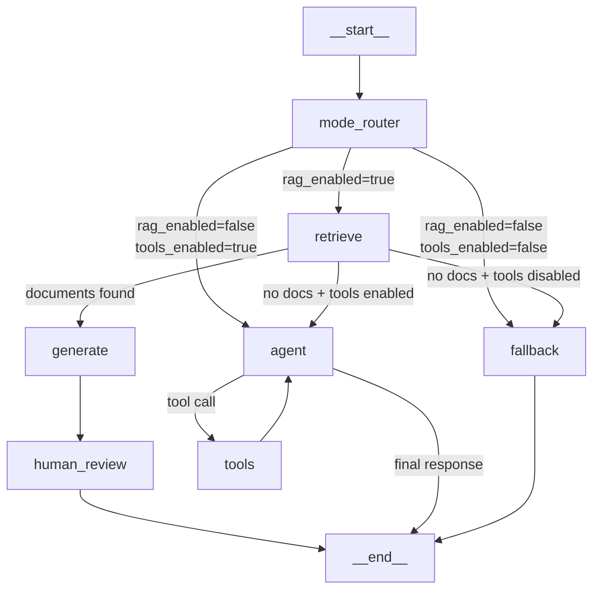
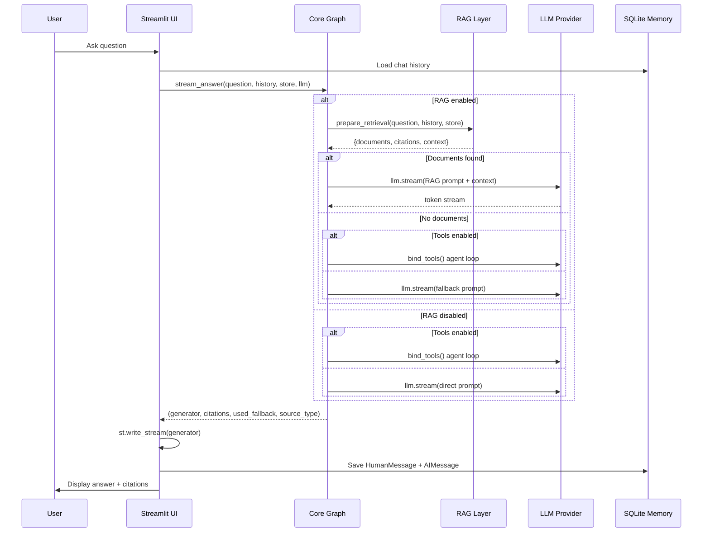
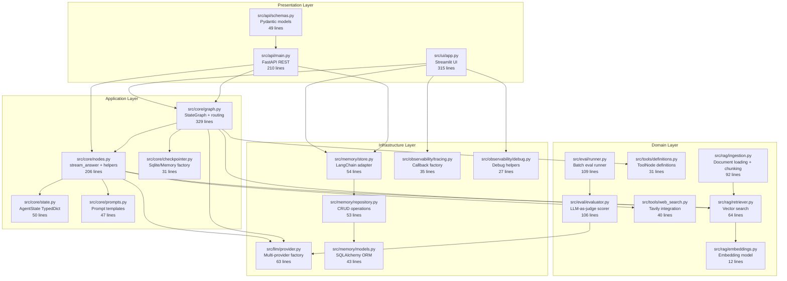
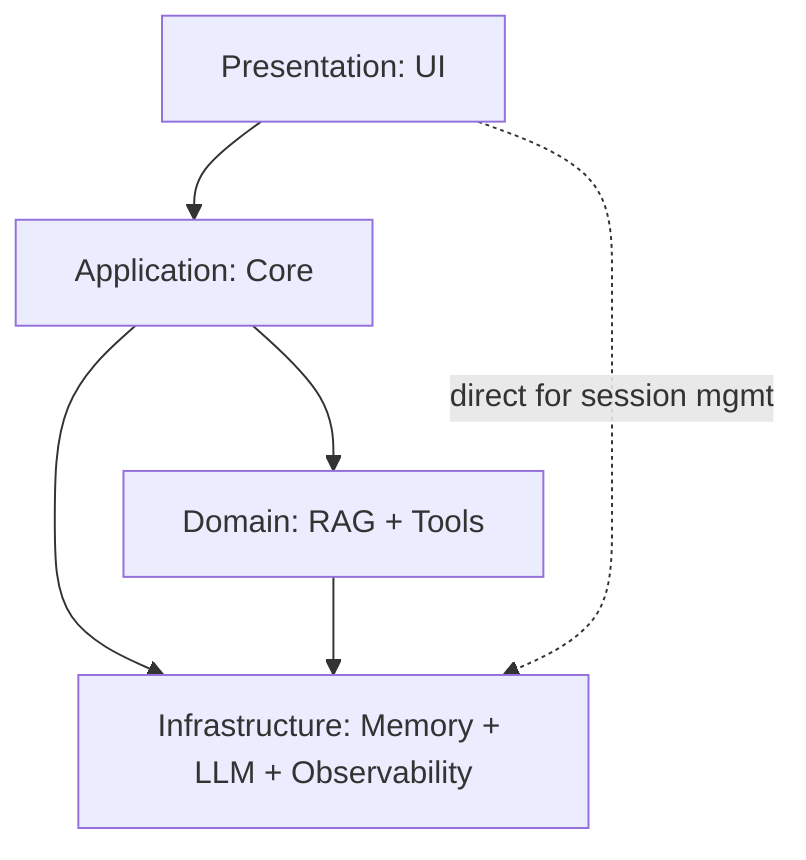

# 🏗️ Architecture

This document explains runtime flow, module boundaries, and design rationale.

---

## 1. Runtime Graph

### Why This Shape?

The graph has **two routing stages**:

1. **Mode Router** — Decides whether to attempt retrieval at all. This avoids wasted embedding computation when RAG is disabled.
2. **Post-Retrieve Router** — Decides what to do with retrieval results. This enables graceful fallback when indexed documents don't match the query.

This two-stage design means **every combination** of settings produces a valid path — there are no dead ends.

---

## 2. End-to-End Data Flow

---

## 3. Component Architecture

---

## 4. Module Responsibilities

| Layer | Module | Files | Responsibility | Key Pattern |
|-------|--------|-------|----------------|-------------|
| **Presentation** | UI | `src/ui/app.py` | User interaction, streaming display, session management | Streamlit session state |
| **Presentation** | API | `src/api/main.py`, `schemas.py` | REST endpoints, thin adapter over core | FastAPI + Pydantic models |
| **Application** | Core | `graph.py`, `nodes.py`, `state.py`, `prompts.py`, `checkpointer.py` | Graph routing, state orchestration, prompt templates, checkpoint factory | StateGraph + conditional edges |
| **Domain** | RAG | `ingestion.py`, `retriever.py`, `embeddings.py` | Document indexing and vector retrieval | Loader dispatch + PersistentClient |
| **Domain** | Tools | `web_search.py`, `definitions.py` | External capability integration, ToolNode definitions | Graceful degradation + @tool |
| **Domain** | Eval | `evaluator.py`, `runner.py`, `dataset.py` | LLM-as-judge scoring, batch evaluation | Pydantic output parsing |
| **Infrastructure** | LLM | `provider.py` | LLM provider abstraction | Factory pattern + Pydantic config |
| **Infrastructure** | Memory | `models.py`, `repository.py`, `store.py` | Session and message persistence | ORM → Repository → LangChain adapter |
| **Infrastructure** | Observability | `tracing.py`, `debug.py` | Tracing callbacks, debug logging | Callback injection (decorator pattern) |

---

## 5. Dependency Direction

Dependencies flow **downward only**. The domain and infrastructure layers never import from the presentation or application layers.

**Exception:** The UI directly accesses `SQLiteChatHistory` for session management. This is a pragmatic shortcut — in a larger system, this would go through an application-layer service.

---

## 6. File Size Budget

The project follows a **300-line max** per file. Current sizes:

| File | Lines | Status |
|------|-------|--------|
| `graph.py` | 329 | ⚠️ Over budget — heavily wired graph |
| `app.py` | 315 | ⚠️ Over budget — candidate for splitting |
| `main.py` (API) | 210 | ✅ |
| `nodes.py` | 206 | ✅ |
| `runner.py` (eval) | 109 | ✅ |
| `evaluator.py` | 106 | ✅ |
| `ingestion.py` | 92 | ✅ |
| `retriever.py` | 64 | ✅ |
| `provider.py` | 63 | ✅ |
| `repository.py` | 53 | ✅ |
| `store.py` | 54 | ✅ |
| `state.py` | 50 | ✅ |
| `schemas.py` | 49 | ✅ |
| `prompts.py` | 47 | ✅ |
| `models.py` | 43 | ✅ |
| `web_search.py` | 40 | ✅ |
| `tracing.py` | 35 | ✅ |
| `dataset.py` | 33 | ✅ |
| `checkpointer.py` | 31 | ✅ |
| `definitions.py` | 31 | ✅ |
| `debug.py` | 27 | ✅ |
| `embeddings.py` | 12 | ✅ |

