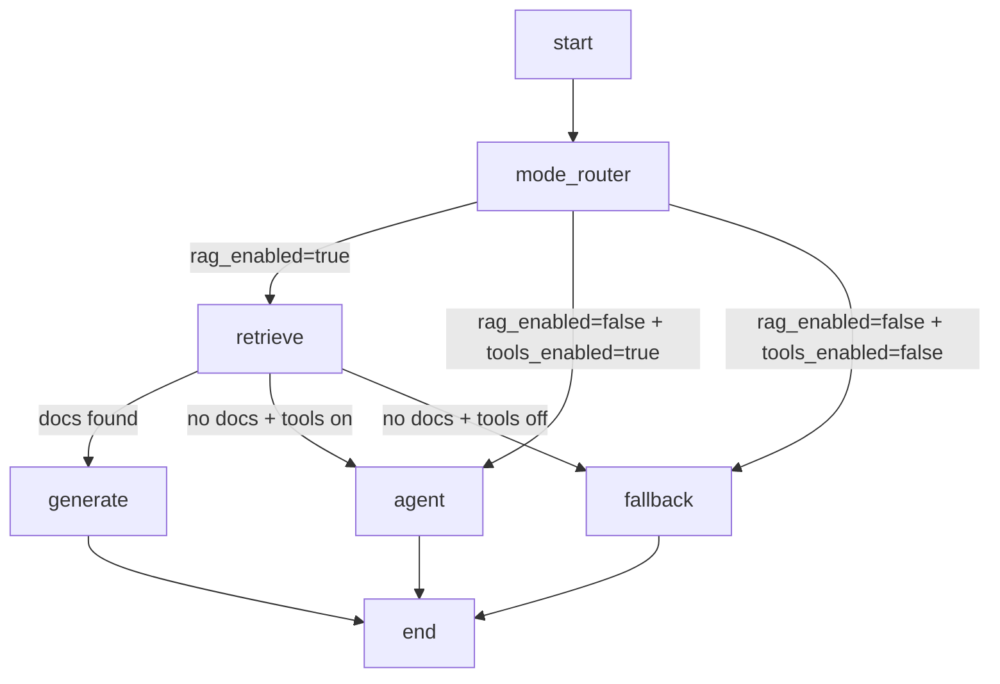
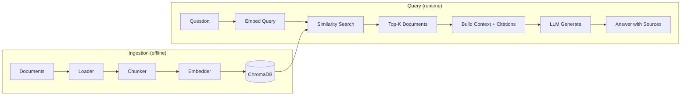
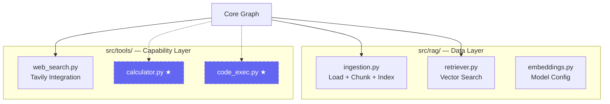
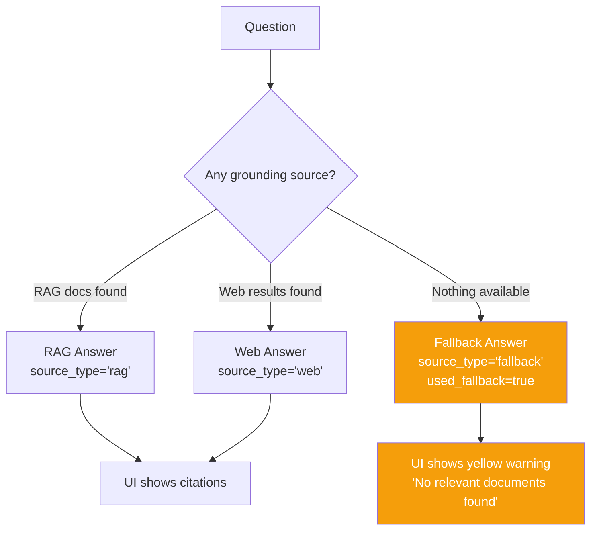
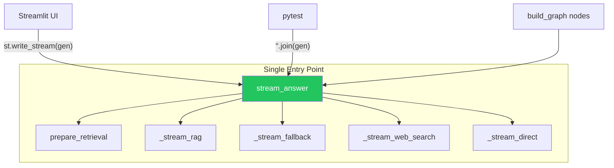
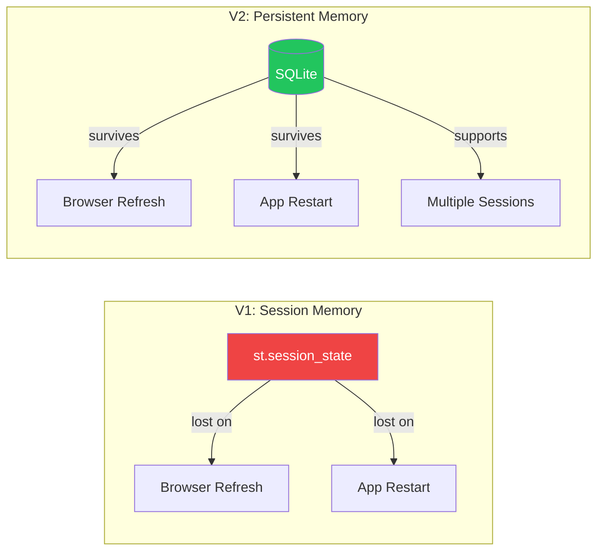
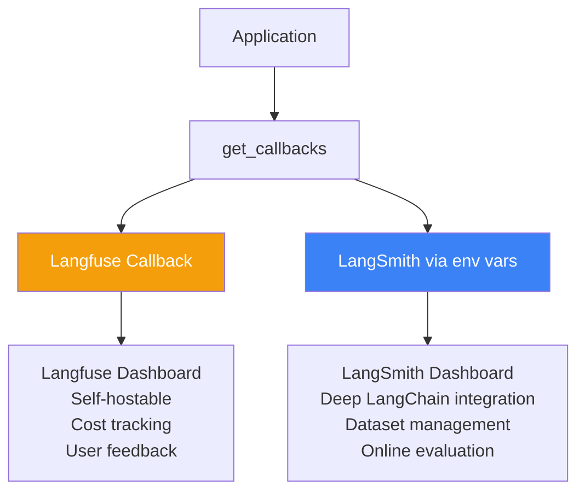
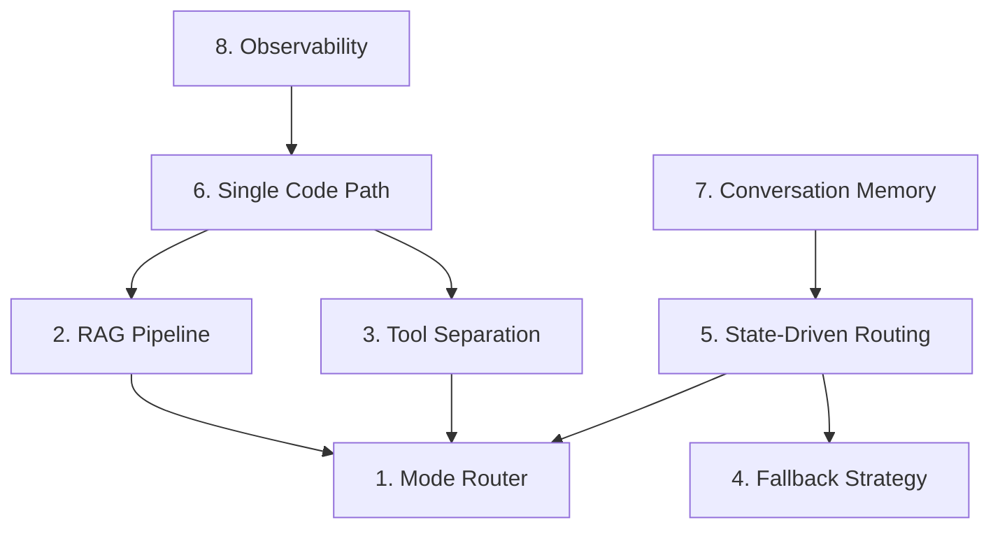

# 📚 Core Concepts — Deep Dive

This document explains not just *what* each concept is, but *why* it was designed this way.
Understanding the reasoning behind each decision is what separates surface-level usage from true mastery.

---

## 1. Mode Router First — Why Not Start With Retrieval?



### The Naive Approach (and why it fails)

Many RAG tutorials start with retrieval as the first node:
```
question → retrieve → generate/fallback
```

This seems simple, but it creates problems:
1. **Wasted compute** — If the user disabled RAG, you still run embeddings + vector search.
2. **Tight coupling** — Adding web search requires modifying the retrieval node instead of adding a parallel path.
3. **No clean "direct LLM" mode** — Every question must pass through retrieval even when the user wants a simple chat.

### The Mode Router Solution

By placing `mode_router` first, we get **explicit intent-based routing**:

```python
def _mode_route(state: AgentState) -> str:
    if state.get("rag_enabled", False):
        return "retrieve"       # Only retrieves if user wants RAG
    if state.get("tools_enabled", False):
        return "agent"          # Skips retrieval entirely
    return "fallback"           # Pure LLM chat — zero overhead
```

**Key insight:** The mode router is a **pass-through node** — it doesn't modify state.
Routing logic lives in the **conditional edge function**, not in the node itself.
This is a core LangGraph pattern: nodes transform state, edges decide flow.

### Why Default to `False`?

```python
state.get("rag_enabled", False)  # NOT True
```

Defaulting to `False` means:
- A minimal state with just `{"question": "..."}` routes to fallback — **safe default**.
- The UI must explicitly enable features — **no surprise compute costs**.
- Tests can exercise fallback without setting up ChromaDB — **simpler test fixtures**.

---

## 2. Retrieval-Augmented Generation — The Full Pipeline



### Why ChromaDB with `PersistentClient`?

```python
client = chromadb.PersistentClient(path="./data/chroma_db")
```

Three alternatives and why they're worse for learning:
1. **In-memory Chroma** — Data lost on app restart. Learners re-index every time.
2. **FAISS** — No metadata filtering, more complex setup, less LangChain integration.
3. **Pinecone/Weaviate** — Requires API keys and cloud accounts. Barrier to entry.

PersistentClient gives you **real persistence** with **zero infrastructure**.

### Why `chunk_size=800, chunk_overlap=150`?

```python
splitter = RecursiveCharacterTextSplitter(
    chunk_size=800,      # ~200 tokens ≈ fits in context window easily
    chunk_overlap=150,   # ~37 tokens ≈ preserves sentence boundaries
)
```

- **800 chars** is small enough that 4 chunks (TOP_K=4) use ~800 tokens — leaving most of the context window for the answer.
- **150 overlap** prevents losing information at chunk boundaries. Without overlap, a sentence split across chunks is lost.
- **RecursiveCharacterTextSplitter** tries paragraph → sentence → word boundaries before splitting mid-word.

### Why `similarity_search_with_score` over `similarity_search`?

```python
def search_with_scores(query, store, k=4):
    return store.similarity_search_with_score(query, k=k)
```

Scores enable two critical features:
1. **Confidence thresholds** — You can filter out low-relevance results before they pollute the context.
2. **Debugging** — When RAG quality drops, scores tell you whether retrieval or generation is the problem.

### Citation Tracking — Why It Matters

```python
citations.append({
    "source": doc.metadata.get("source", "Unknown"),
    "page": doc.metadata.get("page", "N/A"),
    "snippet": doc.page_content[:200]
})
```

Citations aren't just UI decoration — they're **audit trail**:
- Users can verify claims against original documents.
- Developers can debug hallucination by checking which documents were retrieved.
- The `snippet` field lets users see the exact context the LLM used without re-reading the PDF.

---

## 3. Tool vs RAG Separation — Why `src/tools/` Exists



### The Design Decision

RAG and tools serve fundamentally different purposes:
- **RAG** (`src/rag/`) = access to *your* data. It's a retrieval pipeline.
- **Tools** (`src/tools/`) = access to *external capabilities*. They're actions the agent can take.

Keeping them separate means:
- Adding a new tool (calculator, code execution, API call) doesn't touch RAG code.
- RAG can evolve independently (e.g., switch to a different vector store).
- Each tool has a clean, testable interface: `query in → results out`.

### Web Search as a Tool (not RAG)

```python
# src/tools/web_search.py — clean interface
def web_search(query: str, max_results: int = 3) -> list[dict]:
    """Search the web using Tavily API."""

def format_web_context(results: list[dict]) -> str:
    """Format results for LLM context."""
```

Web search is deliberately NOT in `src/rag/` because:
1. It doesn't use embeddings or vector stores.
2. It's an external API call, not a local data operation.
3. In V5, it became a proper LangGraph `Tool` with `bind_tools()` — the agent decides when to use it.

---

## 4. Fallback Strategy — Why Explicit Is Better Than Silent



### Why Not Just Let the LLM Answer Without Warning?

Two problems with silent fallback:
1. **Users trust RAG answers more** — If they uploaded a legal document and ask about it, they expect the answer to come FROM that document. A silent LLM-only answer could hallucinate while looking authoritative.
2. **Debugging is impossible** — Without `used_fallback=True` and `source_type`, you can't tell if low quality answers are a retrieval problem or a generation problem.

### The Three-Way Source Type

```python
source_type: str  # "rag" | "web" | "fallback" | "direct"
```

This field encodes the answer's provenance:
- `"rag"` — Grounded in indexed documents. Highest trust.
- `"web"` — Grounded in web search results. Medium trust.
- `"fallback"` / `"direct"` — LLM's own knowledge. Use with caution.

The UI can then apply different visual treatments to each source type.

---

## 5. State-Driven Routing — The Heart of LangGraph

```mermaid
flowchart LR
    subgraph "AgentState (TypedDict)"
        direction TB
        Q[question: str]
        SID[session_id: str]
        CH[chat_history: list]
        D[documents: list]
        A[answer: str]
        C[citations: list]
        UF[used_fallback: bool]
        ST[source_type: str]
        RE[rag_enabled: bool]
        WE[tools_enabled: bool]
        E[error: str | None]
    end

    subgraph "Routing Decisions"
        RE -->|controls| MODE[Mode Router]
        WE -->|controls| MODE
        D -->|controls| ROUTE[Post-Retrieve Router]
    end
```

### Why TypedDict with `total=False`?

```python
class AgentState(TypedDict, total=False):
    question: Required[str]           # Always needed
    session_id: NotRequired[str]      # Optional — tests skip this
    documents: NotRequired[list]      # Only set after retrieval
    answer: NotRequired[str]          # Only set after generation
```

- `total=False` makes most fields optional — nodes only set what they produce.
- `Required[str]` on `question` ensures the one mandatory field is always present.
- This means you can invoke the graph with `{"question": "Hello"}` and nothing else.

### Why State, Not Arguments?

LangGraph nodes communicate through state, not function arguments. This enables:
1. **Any node can read any field** — No need to thread parameters through call chains.
2. **Conditional edges inspect state** — Routing decisions are based on state content, not return values.
3. **State is serializable** — Enables checkpointing, time-travel debugging, and persistence (V8).

---

## 6. Single Code Path — Why One Entry Point Matters



### The Problem with Separate Paths

Many projects have:
```python
def generate_answer_streaming(question):  # for UI
    ...

def generate_answer(question):           # for tests
    ...  # subtly different logic
```

This leads to **behavior drift** — the test path works but the UI path doesn't (or vice versa).

### The Solution

`stream_answer()` returns a **generator**. The consumer decides whether to stream or collect:

```python
# UI — streams token by token
answer = st.write_stream(token_generator)

# Tests — collects all tokens
answer = "".join(token_generator)
```

**Same code path, same behavior, zero duplication.**

---

## 7. Conversation Memory — Why SQLite Over Session State



### Why BaseChatMessageHistory Interface?

```python
class SQLiteChatHistory(BaseChatMessageHistory):
    @property
    def messages(self) -> list[BaseMessage]: ...
    def add_message(self, message: BaseMessage) -> None: ...
    def clear(self) -> None: ...
```

By implementing LangChain's `BaseChatMessageHistory`, the store is:
- **Pluggable** — Swap SQLite for PostgreSQL or Redis without changing the graph.
- **Compatible** — Works with LangChain's `RunnableWithMessageHistory` if needed.
- **Testable** — Tests can create isolated DB instances with `tmp_path`.

### Why Trim to Last 6 Messages?

```python
recent_history = (chat_history or [])[-6:]  # Last 3 Q&A turns
```

- **Token budget** — Each message consumes context window space. 6 messages ≈ 600-1200 tokens.
- **Relevance decay** — Older messages are less relevant to the current question.
- **3 turns** is enough for follow-up questions ("tell me more about that") without flooding the prompt.

---

## 8. Observability — Why Dual Tracing?



### Why Both Langfuse AND LangSmith?

They solve different problems:
- **Langfuse** — Best for production monitoring: cost tracking, latency, user feedback loops. Self-hostable.
- **LangSmith** — Best for development: dataset management, evaluation runs, deep LangChain integration.

The `get_callbacks()` factory returns both when enabled — zero overhead when disabled:

```python
callbacks = []  # Empty list = no tracing, no performance hit
```

### Why Callbacks, Not Middleware?

LangChain's callback system is designed to be **non-invasive**:
```python
for chunk in llm.stream(messages, config={"callbacks": callbacks}):
    yield chunk.content
```

The streaming logic doesn't change. Tracing is injected through config.
This is the **decorator pattern** — add behavior without modifying the core.

---

## Concept Dependency Graph



