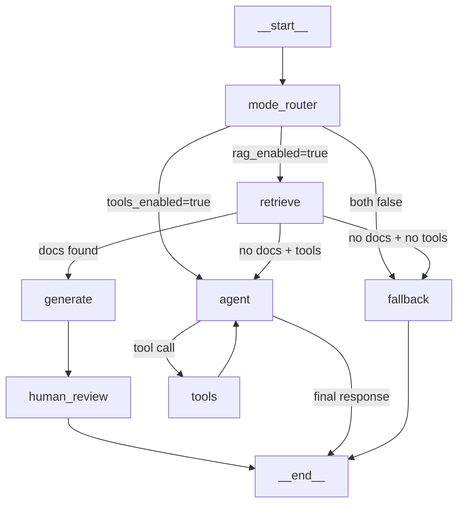

# 🐞 Debugging Guide

## 1. Expected Graph Topology

When `LANGGRAPH_DEBUG=true`, the app exports a PNG to `docs/graph.png`. The expected shape:



---

## 2. Diagnostic Checklist

Use this sequence when things aren't working:

```mermaid
flowchart TD
    START[Problem observed] --> Q1{What source_type\nin response?}
    
    Q1 -->|"rag"| RAG_OK[RAG path works ✅\nCheck citations quality]
    Q1 -->|"web"| WEB[Check: did RAG miss?\nOr was RAG disabled?]
    Q1 -->|"fallback" / "direct"| FB[Check below ↓]
    Q1 -->|"No answer"| ERR[Check error field\nand terminal logs]

    FB --> Q2{Is rag_enabled true?}
    Q2 -->|No| Q3{Is tools_enabled true?}
    Q2 -->|Yes| Q4{Are documents indexed?}
    
    Q3 -->|No| FIX1[Expected behavior.\nEnable RAG or web search]
    Q3 -->|Yes| FIX2[Check TAVILY_API_KEY\nin .env]

    Q4 -->|No| FIX3[Upload and index\ndocuments first]
    Q4 -->|Yes| Q5{Does retrieval return\nrelevant docs?}

    Q5 -->|No| FIX4[Check embeddings\nand chunk settings]
    Q5 -->|Yes| FIX5[Bug: should route\nto generate, not fallback]
```

### Quick State Checks

| Check | What to look for | Where to look |
|-------|-----------------|---------------|
| RAG enabled? | `rag_enabled` in state | UI sidebar toggle |
| Tools enabled? | `tools_enabled` in state | UI sidebar toggle |
| Documents indexed? | Collection has entries | ChromaDB data dir |
| Retrieval working? | `documents` list non-empty after retrieve | Debug logs |
| Source type? | `source_type` field in result | UI response metadata |
| Fallback used? | `used_fallback` is `True` | UI yellow notice |

---

## 3. Enabling Debug Mode

### Graph PNG Export

```powershell
# PowerShell
$env:LANGGRAPH_DEBUG="true"
streamlit run src/ui/app.py
```

This will:
1. Enable verbose LangGraph logging to stdout.
2. Build the graph once at startup.
3. Export graph snapshot to `docs/graph.png`.

### Verbose Tracing

Enable both Langfuse and LangSmith for maximum visibility:

```powershell
$env:LANGFUSE_ENABLED="true"
$env:LANGSMITH_ENABLED="true"
streamlit run src/ui/app.py
```

Check dashboards:
- Langfuse: `https://cloud.langfuse.com` → look for traces with your session ID
- LangSmith: `https://smith.langchain.com` → check project `qa-rag-agent`

---

## 4. Common Issues + Fixes

| Issue | Likely Cause | Fix |
|-------|-------------|-----|
| Tools path never triggers | `tools_enabled` is false | Enable flag in UI sidebar AND set `TAVILY_API_KEY` in `.env` |
| Fallback too frequent | No indexed documents + tools disabled | Upload documents and click Index, or enable tools |
| Generate not used | Retriever returns empty docs | Reindex documents. Check if query is too different from doc content |
| Low-quality answers | Wrong chunks retrieved | Adjust `TOP_K`, `chunk_size`, `chunk_overlap`. Check embedding model |
| Mermaid not rendering | IDE preview config | Enable Mermaid support in VS Code markdown preview extension |
| API key errors | Missing or invalid key | Check `.env` file. Verify key prefix (`sk-` for OpenAI, `gsk_` for Groq) |
| ChromaDB errors on restart | Corrupt persist directory | Delete `data/chroma_db/` and re-index |
| SQLite lock errors | Multiple processes accessing `memory.db` | Ensure only one Streamlit instance is running |
| Graph PNG not generated | Missing `graphviz` or network issue | Install: `pip install graphviz`. Mermaid PNG needs internet for rendering |
| Streaming stops mid-answer | LLM rate limit or timeout | Check provider dashboard. Increase timeout or switch model |

---

## 5. Manual Smoke Test Sequence

Run these in order to validate the full system:

| Step | Action | Expected Result |
|------|--------|-----------------|
| 1 | Start app: `streamlit run src/ui/app.py` | UI loads at `http://localhost:8501` |
| 2 | Upload a PDF, click Index | Status shows "X chunks indexed" |
| 3 | Enable RAG toggle in sidebar | `rag_enabled=true` |
| 4 | Ask a question about the PDF | Answer with citations, `source_type=rag` |
| 5 | Ask an unrelated question | May fallback — check `source_type` |
| 6 | Enable Use Tools toggle | `tools_enabled=true` |
| 7 | Ask an unrelated question | Should use web search if no RAG docs match |
| 8 | Disable both toggles | Should use direct/fallback mode |
| 9 | Switch LLM provider in sidebar | New model generates next answer |
| 10 | Click "New Session" | Chat history cleared, new session started |
| 11 | Load previous session from dropdown | Old messages restored |
| 12 | Restart app, reload session | Messages persist (SQLite) |

