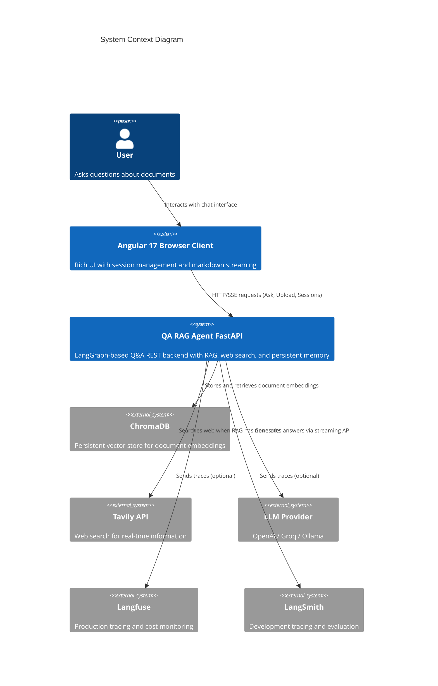
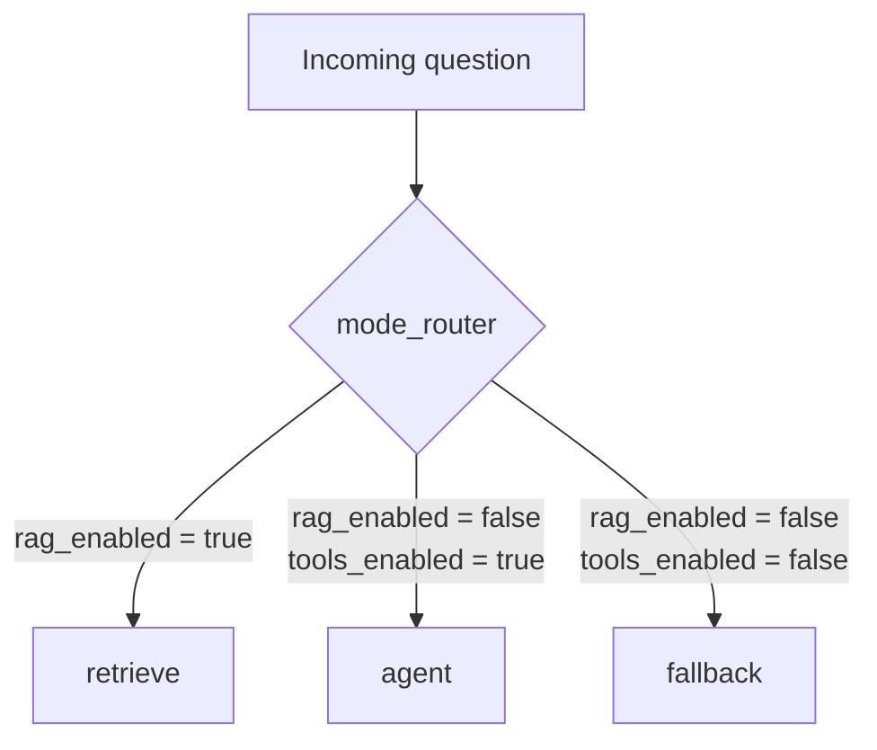
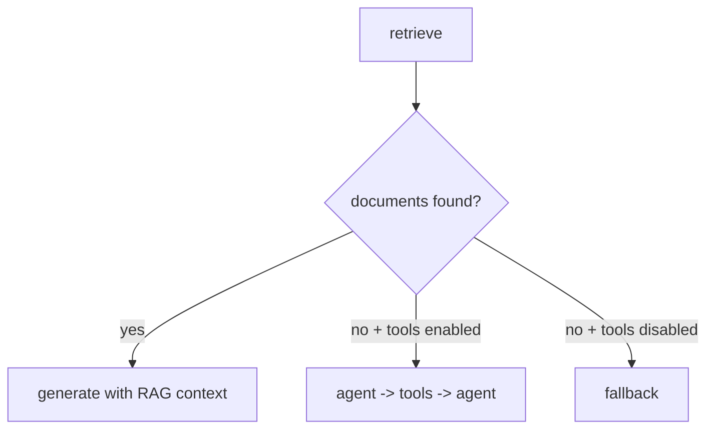
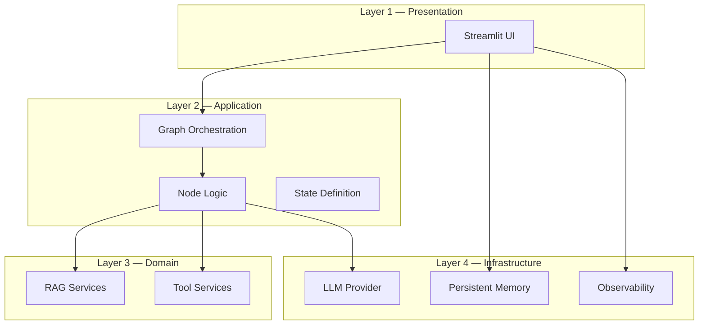
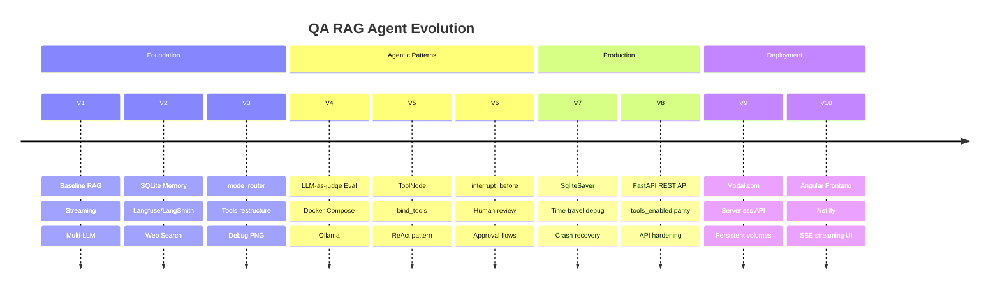

# 🧱 HLD — High-Level Design

## 🎯 Objective

Build a maintainable, learning-friendly QA system that demonstrates core agentic AI patterns through a real working application.

The system routes questions to the best available answer source:
1. **RAG generation** from locally indexed documents (highest trust)
2. **Web-grounded generation** using Tavily search (medium trust)
3. **Fallback answer** from LLM's general knowledge (lowest trust, clearly labeled)

---

## 🌍 System Context

---

## 🧠 Routing Design

The routing system has two decision stages:

### Stage 1: Mode Router (entry point)

**Design rationale:** The mode router is placed BEFORE retrieval to avoid wasted compute. If the user has disabled RAG, there's no point running embeddings and vector search.

### Stage 2: Post-Retrieve Router

**Design rationale:** Even when RAG is enabled, retrieval might return no relevant documents. The post-retrieve router provides a graceful cascade to web search or fallback.

---

## 🧩 Logical Layers

**Dependency rule:** Higher layers depend on lower layers. Lower layers never import from higher layers.

---

## ✅ Quality Attributes

| Attribute | Design Choice | How It's Achieved |
|---|---|---|
| **Maintainability** | Explicit node boundaries and typed state | `AgentState(TypedDict)` with `Required`/`NotRequired` annotations |
| **Extensibility** | New nodes/tools can be added with local impact | Add node to `build_graph()` + add edge — no existing code changes |
| **Reliability** | Deterministic fallback route | Every routing combination has a valid terminal path |
| **Testability** | Single code path for streaming and collection | `stream_answer()` returns generator — UI streams it, tests collect it |
| **Observability** | Trace-ready callback hooks | `get_callbacks()` injects tracing without modifying core logic |
| **Learning** | Visual routing and layered docs | Mermaid diagrams in every doc, guided learning path |
| **Performance** | Lazy imports and conditional execution | LLM providers loaded only when selected, tracing has zero overhead when disabled |

---

## 🔮 Evolution Path

V1–V8 are **fully implemented**. V9–V10 have **prompts ready**. See [VERSIONS.md](VERSIONS.md) for details.

