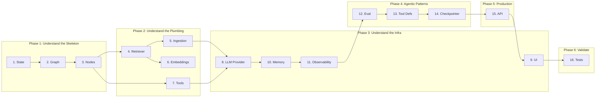

# 🧭 Learning Path

A guided reading order for understanding the QA RAG Agent from the ground up.
Each step builds on the previous one — don't skip ahead.

---

## Visual Roadmap

---

## Phase 1: Understand the Skeleton

### Step 1 — [state.py](file:///c:/AIML/POC/qa-rag-agent/src/core/state.py) (34 lines)

**What you'll learn:** How data flows through the entire system.

`AgentState` is a `TypedDict` that every graph node reads from and writes to.
Start here because every other file references these fields.

**Key things to notice:**
- `total=False` makes most fields optional — nodes only set what they produce.
- `Required[str]` on `question` ensures the one mandatory input is always present.
- `rag_enabled` and `tools_enabled` are boolean flags that control routing.

**Question to answer before moving on:** *What is the minimum state needed to invoke the graph?*
> Answer: Just `{"question": "some text"}` — everything else has defaults.

---

### Step 2 — [graph.py](file:///c:/AIML/POC/qa-rag-agent/src/core/graph.py) (237 lines)

**What you'll learn:** How LangGraph wires nodes together with conditional routing.

This is the orchestration layer. Two things coexist here:
1. `build_graph()` — Creates a `StateGraph` with nodes and edges. Used by `langgraph dev`.
2. `run_graph()` — A simple wrapper that collects `stream_answer()` into a dict. Used by tests.

**Key things to notice:**
- `_mode_router_node` is a **pass-through** — it doesn't modify state. Routing logic lives in `_mode_route`.
- `add_conditional_edges` takes a function + a mapping dict. The function returns a key, the dict maps keys to node names.
- Every terminal path (`generate -> human_review`, `agent`, `fallback`) eventually connects to `END`.

**Question to answer:** *Why does `_mode_router_node` exist if it does nothing?*
> Answer: LangGraph requires a node to attach conditional edges to. The node is the "decision point" even though the decision logic is in the edge function.

---

### Step 3 — [nodes.py](file:///c:/AIML/POC/qa-rag-agent/src/core/nodes.py) (245 lines)

**What you'll learn:** The single code path pattern and how streaming works.

This is the most important file. `stream_answer()` is THE entry point for all answer generation.

**Key things to notice:**
- Private functions (`_stream_rag`, `_stream_fallback`, etc.) are **generators** that `yield` tokens.
- `prepare_retrieval()` is synchronous — it does retrieval and routing without LLM calls.
- `stream_answer()` decides which generator to return based on a 3-step cascade: RAG → Web → Direct.

**Question to answer:** *How does the UI stream tokens while tests collect them?*
> Answer: Both call `stream_answer()`. The UI does `st.write_stream(generator)`. Tests do `"".join(generator)`. Same generator, different consumers.

---

## Phase 2: Understand the Plumbing

### Step 4 — [retriever.py](file:///c:/AIML/POC/qa-rag-agent/src/rag/retriever.py) (84 lines)

**What you'll learn:** ChromaDB integration and similarity search.

**Key things to notice:**
- `PersistentClient` means data survives app restarts — no re-indexing needed.
- `search_with_scores()` returns `(Document, float)` tuples — scores enable quality filtering.
- `clear_collection()` accesses `store._collection` directly — a pragmatic choice over a more abstract API.

---

### Step 5 — [ingestion.py](file:///c:/AIML/POC/qa-rag-agent/src/rag/ingestion.py) (125 lines)

**What you'll learn:** Document loading, chunking, and the indexing pipeline.

**Key things to notice:**
- `LOADER_MAP` dispatches by file extension — adding a new format is one line.
- `load_and_chunk()` ensures every chunk has `source` metadata — critical for citations.
- `reindex()` = clear + ingest. Simple but effective for development.

---

### Step 6 — [embeddings.py](file:///c:/AIML/POC/qa-rag-agent/src/rag/embeddings.py) (17 lines)

**What you'll learn:** Why local embeddings are preferred for learning.

`all-MiniLM-L6-v2` runs on CPU, needs no API key, and produces 384-dim vectors.
It's the standard choice for learning because it removes the API key barrier.

---

### Step 7 — [web_search.py](file:///c:/AIML/POC/qa-rag-agent/src/tools/web_search.py) (54 lines)

**What you'll learn:** How external tools integrate with the agent.

**Key things to notice:**
- Lives in `src/tools/`, NOT `src/rag/` — web search is a capability, not a retrieval mechanism.
- Graceful degradation: returns `[]` if Tavily isn't configured. Never crashes.
- `format_web_context()` mirrors `build_context_and_citations()` from nodes — same pattern, different source.

---

## Phase 3: Understand the Infrastructure

### Step 8 — [provider.py](file:///c:/AIML/POC/qa-rag-agent/src/llm/provider.py) (84 lines)

**What you'll learn:** The factory pattern for multi-provider LLM support.

**Key things to notice:**
- `LLMConfig` is a Pydantic `BaseModel` with `Field(default_factory=...)` — defaults come from env vars.
- Each provider import is **lazy** (inside `if` blocks) — only the chosen provider's package is loaded.
- `PROVIDER_MODELS` dict powers the UI dropdown — adding models is data, not code.

---

### Step 9 — [app/features/chat/chat.component.ts](file:///c:/AIML/POC/qa-rag-agent/qa-rag-agent-ui/src/app/features/chat/chat.component.ts)

**What you'll learn:** How everything comes together in a real, decoupled UI.

The UI is intentionally separated into an Angular application to demonstrate production readiness (most enterprise AI apps are not monolithic Streamlit scripts).

**Key things to notice:**
- `StreamService` handles consuming the SSE tokens.
- We JSON-decode incoming tokens to protect markdown newlines across the network boundary before rendering them.

**Question to answer:** *Why must we JSON-encode tokens over SSE instead of sending raw strings?*
> Answer: Because tokens featuring markdown bullet points or headers contain raw `\n` characters. If sent as raw strings, the browser's SSE parser would consume those newlines as stream delimiters, destroying the markdown structure.

---

### Step 10 — [memory/](file:///c:/AIML/POC/qa-rag-agent/src/memory/) (3 files)

**What you'll learn:** SQLAlchemy ORM, repository pattern, and LangChain compatibility.

Read in this order:
1. `models.py` — ORM table definitions (`ConversationSession`, `ConversationMessage`)
2. `repository.py` — CRUD functions (create, read, update, delete)
3. `store.py` — `SQLiteChatHistory` wrapper that implements `BaseChatMessageHistory`

**Key pattern:** Models → Repository → LangChain Adapter. Three layers of abstraction.

---

### Step 11 — [observability/](file:///c:/AIML/POC/qa-rag-agent/src/observability/) (2 files)

**What you'll learn:** Non-invasive tracing and debug exports.

- `tracing.py` — `get_callbacks()` factory. Returns `[]` when disabled = zero overhead.
- `debug.py` — Graph PNG export and verbose logging. Activated by env var.

---

## Phase 4: Agentic Patterns

### Step 12 — [eval/](file:///c:/AIML/POC/qa-rag-agent/src/eval/) (3 files, ~248 lines)

**What you'll learn:** LLM-as-judge evaluation — testing RAG quality without humans.

Read in this order:
1. `dataset.py` — JSON dataset loader with validation
2. `evaluator.py` — LLM scores answers on faithfulness, relevance, completeness (0.0–1.0)
3. `runner.py` — Batch runner that produces formatted evaluation reports

**Key insight:** The evaluator uses structured output parsing (`json.loads()` with markdown stripping) — a real-world pattern for extracting structured data from LLM responses.

---

### Step 13 — [tools/definitions.py](file:///c:/AIML/POC/qa-rag-agent/src/tools/definitions.py) (31 lines)

**What you'll learn:** How LangGraph `ToolNode` + `bind_tools()` creates agentic behavior.

**Key things to notice:**
- `@tool` decorator registers functions as LangChain tools with schemas
- `TOOLS` list is what gets bound to the LLM via `llm.bind_tools(TOOLS)`
- The graph's `agent` node decides whether to call tools — it's the LLM choosing, not hardcoded logic

**Question to answer:** *How does the agent decide to use web search vs answer directly?*
> Answer: The LLM receives tool definitions and decides based on the question. If it calls a tool, the graph routes to `tools` node, then back to `agent` for another decision.

---

### Step 14 — [checkpointer.py](file:///c:/AIML/POC/qa-rag-agent/src/core/checkpointer.py) (31 lines)

**What you'll learn:** Graph state persistence and time-travel debugging.

**Key things to notice:**
- `get_checkpointer()` returns `SqliteSaver` in production, `MemorySaver` in tests
- Thread-based isolation via `get_thread_config()` — each conversation is independent
- `build_graph()` accepts `checkpointer` and `interrupt_before` parameters

---

## Phase 5: Production Readiness

### Step 15 — [api/](file:///c:/AIML/POC/qa-rag-agent/src/api/) (2 files, ~259 lines)

**What you'll learn:** How to expose an agentic system as a REST API.

Read in this order:
1. `schemas.py` — Pydantic request/response models with validation
2. `main.py` — FastAPI app with 6 endpoints, CORS, lazy resource loading

**Key things to notice:**
- The API is a **thin adapter** — zero business logic. It calls the same `run_graph()` and `stream_answer()` as the UI.
- `tools_enabled` (not `web_search_enabled`) — generic naming makes it future-proof for new tools
- Streaming uses SSE (`text/event-stream`) — same pattern any frontend framework can consume

**Question to answer:** *Why keep both Streamlit UI and FastAPI?*
> Answer: Streamlit = interactive development/demo. FastAPI = production inter-service communication. Both call the same core functions — different adapters, same engine.

---

## Phase 6: Validate Your Understanding

### Step 16 — [tests/](file:///c:/AIML/POC/qa-rag-agent/tests/) (11 test files, 78 tests)

**What you'll learn:** How to test agentic systems without real LLMs.

Read in this order:
1. `conftest.py` — Fixtures: `mock_llm`, `tmp_chroma_store`, `sample_txt_path`
2. `test_graph.py` — Tests routing, RAG path, fallback path, history forwarding
3. `test_tools.py` — Tests tool definitions and agent routing
4. `test_human_loop.py` — Tests approve/reject/feedback flows
5. `test_checkpointing.py` — Tests checkpointer factory and graph compilation
6. `test_api.py` — Tests FastAPI endpoints with `TestClient` and mocked core
7. `test_eval.py` — Tests evaluator scoring and dataset loading
8. `test_memory_sqlite.py` — Tests CRUD, persistence, LangChain types
9. `test_ingestion.py` — Tests document loading and chunking
10. `test_retrieval.py` — Tests vector search
11. `test_observability.py` — Tests callback factory with mocked env vars

**Key insight:** The mock LLM in `conftest.py` is worth studying closely — it shows how to test LLM-dependent code without API calls or costs.

---

## After You've Read Everything

Try these exercises to test your understanding:

### Foundation Exercises
1. **Add a new document format** — Support `.csv` files by adding a loader to `LOADER_MAP`.
2. **Add a score threshold** — Modify `prepare_retrieval()` to filter out documents below a score threshold.
3. **Add a new LLM provider** — Add Anthropic to `provider.py` (follow the existing pattern).

### Agentic Exercises
4. **Add a new tool** — Create a calculator tool in `src/tools/`, add it to `TOOLS` list, watch the agent use it.
5. **Add a graph node** — Create a `summarize` node that condenses long answers before returning them.
6. **Custom evaluation metric** — Add a "conciseness" score to `evaluator.py`.
7. **Write a test** — Test that web search gracefully returns empty when `TAVILY_API_KEY` is not set.

### Production Exercises
8. **Add an API endpoint** — Create `GET /api/documents` that lists all indexed documents.
9. **Add rate limiting** — Protect the `/api/ask` endpoint from abuse.

