# 🎯 Use Cases

This document maps real-world use cases to the agent's routing modes, with concrete examples.

---

## Use Case Matrix

```mermaid
flowchart TD
    subgraph "Use Case 1: Internal Knowledge Assistant"
        UC1Q[Employee asks:\n'What is our refund policy?'] --> UC1R[RAG retrieves\ncompany handbook] --> UC1A[Answer with\ncitations to page 42]
    end

    subgraph "Use Case 2: Hybrid Research Assistant"
        UC2Q[Researcher asks:\n'Latest findings on mRNA?'] --> UC2R[RAG: no local docs] --> UC2W[Web search finds\nrecent papers] --> UC2A[Answer with\nweb source URLs]
    end

    subgraph "Use Case 3: General Chat Assistant"
        UC3Q[User asks:\n'Explain quantum computing'] --> UC3F[No RAG, no web] --> UC3A[Direct LLM answer\nwith fallback notice]
    end
```

---

## 1. Internal Knowledge Assistant 📘

**Scenario:** A company indexes internal documents (policies, handbooks, SOPs) and employees ask questions.

| Setting | Value |
|---------|-------|
| `rag_enabled` | `true` |
| `tools_enabled` | `false` |
| Indexed docs | Company handbook, HR policies, technical SOPs |

**What happens:**
1. Employee asks: *"What is the process for requesting time off?"*
2. Mode router → `retrieve` (RAG enabled)
3. ChromaDB returns relevant chunks from `hr_handbook.pdf`
4. LLM generates answer citing page numbers
5. UI shows citations: `hr_handbook.pdf, Page 15`

**Why this works:** RAG ensures answers come FROM company documents, not hallucinated. Citations provide auditability.

---

## 2. Hybrid Research Assistant 🔎

**Scenario:** A researcher indexes their own papers but also needs web search for topics not in their corpus.

| Setting | Value |
|---------|-------|
| `rag_enabled` | `true` |
| `tools_enabled` | `true` |
| Indexed docs | Personal research papers |

**What happens (RAG hit):**
1. Researcher asks: *"What methodology did I use in experiment 3?"*
2. Mode router → `retrieve` → docs found → `generate`
3. Answer grounded in their own paper

**What happens (RAG miss):**
1. Researcher asks: *"What are the latest mRNA vaccine developments?"*
2. Mode router → `retrieve` → no docs → `agent → tools → agent`
3. Tavily searches the web → results formatted as context
4. LLM generates answer with web source URLs

**Why this works:** The cascade (RAG → Web → Fallback) ensures the best available source is always used.

---

## 3. Fallback Safety Mode 🛟

**Scenario:** A user disables both RAG and web search for a pure chat experience.

| Setting | Value |
|---------|-------|
| `rag_enabled` | `false` |
| `tools_enabled` | `false` |

**What happens:**
1. User asks: *"Explain the theory of relativity"*
2. Mode router → `fallback` (both disabled)
3. LLM answers from its training knowledge
4. UI shows yellow notice: *"Answer based on general knowledge"*

**Why this works:** Explicit fallback with a clear visual indicator prevents users from mistaking an ungrounded answer for a document-backed one.

---

## 4. Document Comparison 📊

**Scenario:** A user uploads multiple versions of a contract and asks about differences.

| Setting | Value |
|---------|-------|
| `rag_enabled` | `true` |
| `tools_enabled` | `false` |
| Indexed docs | `contract_v1.pdf`, `contract_v2.pdf` |

**What happens:**
1. User asks: *"What changed between version 1 and version 2?"*
2. Retrieval returns chunks from both documents (TOP_K=4 may pull from both)
3. Citations show which document each fact came from
4. LLM can compare because both contexts are in the prompt

**Limitation:** This only works if the relevant differences are captured in the top-K chunks. For full document comparison, a dedicated diffing tool would be better.

---

## 5. Multi-Model Evaluation 🧪

**Scenario:** A developer tests answer quality across different LLM providers.

| Setting | Value |
|---------|-------|
| Runtime model switching | OpenAI → Groq → Ollama |
| Same question/docs | Compare answers side by side |

**What happens:**
1. Ask a question with OpenAI `gpt-4o-mini` → note answer quality
2. Switch to Groq `llama-3.1-8b-instant` in sidebar → ask same question
3. Switch to Ollama `llama3.2` → ask same question
4. Compare answers, latency, and citation quality

**Why this works:** The multi-provider factory pattern means switching models is a dropdown change, not a code change.

---

## Routing Decision Table

| `rag_enabled` | `tools_enabled` | Documents Found | Route | Source Type |
|:---:|:---:|:---:|---|---|
| ✅ | ✅ | ✅ | `retrieve → generate → human_review` | `rag` |
| ✅ | ✅ | ❌ | `retrieve → agent → tools → agent` | `web` |
| ✅ | ❌ | ✅ | `retrieve → generate → human_review` | `rag` |
| ✅ | ❌ | ❌ | `retrieve → fallback` | `fallback` |
| ❌ | ✅ | — | `mode_router → agent → tools → agent` | `web` |
| ❌ | ❌ | — | `mode_router → fallback` | `direct` |

---

## 6. RAG Quality Evaluation 🧪 (V4)

**Scenario:** A developer wants to measure how well the RAG pipeline answers questions about their indexed documents.

| Setting | Value |
|---------|-------|
| Command | `python -m src.eval.runner --dataset data/eval_dataset.json` |
| Metrics | Faithfulness, Relevance, Completeness (1-5 scale) |

**What happens:**
1. Eval runner loads questions from `data/eval_dataset.json`
2. For each question: retrieve context → generate answer → LLM-as-judge scores it
3. Formatted report shows per-question and average scores

**Why this works:** LLM-as-judge evaluation gives quantitative quality metrics without manual review. Faithfulness catches hallucination; relevance catches off-topic answers; completeness catches missing information.

---

## 7. Tool-Calling Agent 🛠️ (V5)

**Scenario:** The agent autonomously decides to search the web when it lacks knowledge, instead of being hardcoded.

| Setting | Value |
|---------|-------|
| `rag_enabled` | `false` |
| `tools_enabled` | `true` |
| Pattern | ReAct (Reason → Act → Observe) |

**What happens:**
1. User asks: *"What happened in AI news today?"*
2. Mode router → `agent` node (LLM with bound tools)
3. LLM decides: *"I need current info, let me call web_search_tool"*
4. `ToolNode` executes `web_search_tool("AI news today")`
5. Results flow back to agent → LLM generates final answer with citations
6. If LLM decides no tool is needed, it responds directly (no tool call)

**Why this works:** The LLM decides WHEN to use tools based on the question, rather than hardcoded routing. Adding new tools (calculator, code execution) only requires adding to the `TOOLS` list.

---

## 8. Human-in-the-Loop Review 👤 (V6)

**Scenario:** A compliance team needs to review AI-generated answers before they reach end users.

| Setting | Value |
|---------|-------|
| `interrupt_before` | `["tools"]` (or any node) |
| Review flow | Approve → continue, Reject → override answer |

**What happens (approval):**
1. User asks a question → agent generates answer
2. Graph pauses at `human_review` node
3. Reviewer sees the answer and approves → graph continues → answer shown
4. `human_approved: True` stored in state

**What happens (rejection):**
1. Reviewer sees the answer and rejects with feedback: *"Missing regulatory citation"*
2. Answer overridden: *"Answer rejected by reviewer. Missing regulatory citation."*
3. `source_type` set to `"rejected"`, `used_fallback: True`

**Why this works:** `interrupt_before` pauses the graph mid-execution. The checkpointer saves state so the graph can resume after human decision. This is essential for high-stakes domains (legal, medical, financial).

---

## 9. Time-Travel Debugging 🕰️ (V7)

**Scenario:** A developer wants to understand why the agent gave a wrong answer by replaying the execution step by step.

| Setting | Value |
|---------|-------|
| `CHECKPOINT_DB_PATH` | `./data/checkpoints.db` |
| Checkpointer | `SqliteSaver` (durable) |
| Thread ID | Unique per conversation |

**What happens:**
1. User asks a question → graph runs through `mode_router → retrieve → generate → human_review → END`
2. Each step is checkpointed to SQLite with node name + full state
3. Developer calls `get_execution_history(graph, thread_id)`
4. Sees exactly what each node produced: which documents were retrieved, what context was sent, what answer was generated
5. Developer can identify where the pipeline broke down

**Why this works:** `SqliteSaver` persists graph state across restarts. Every node execution creates a checkpoint. State history enables debugging without re-running the query.

---

## 10. REST API Integration 🔌

**Scenario:** Another microservice (Java, Node.js, .NET) needs to ask the agent questions programmatically.

| Setting | Value |
|---------|-------|
| API server | `uvicorn src.api.main:app --port 8000` |
| Protocol | Standard REST + JSON |

**What happens:**
1. External service sends `POST /api/ask` with `{"question": "What is our refund policy?", "rag_enabled": true}`
2. FastAPI calls the same `run_graph()` that the Streamlit UI uses
3. Returns JSON: `{"answer": "...", "citations": [...], "source_type": "rag"}`
4. For streaming: `POST /api/ask/stream` returns Server-Sent Events

**Why this works:** The FastAPI layer is a thin adapter — zero business logic. Any service that can make HTTP requests can consume the agent. No LangGraph SDK or Python required on the client side.

