# Version Roadmap

This document maps every prompt version to its theme, implementation status, and dependencies.

## Version Chain

```mermaid
flowchart LR
    V1["V1\nBaseline RAG"]
    V2["V2\nMemory + Observability\n+ Web Search"]
    V3["V3\nAlignment Patch"]
    V4["V4\nEval + Docker"]
    V5["V5\nTool-Calling"]
    V6["V6\nHuman-in-the-Loop"]
    V7["V7\nCheckpointing"]
    V8["V8\nFastAPI Parity"]
    V9["V9\nModal Deployment"]
    V10["V10\nAngular Frontend"]

    V1 --> V2 --> V3 --> V4 --> V5 --> V6 --> V7 --> V8 --> V9 --> V10

    style V1 fill:#22c55e,color:#fff
    style V2 fill:#22c55e,color:#fff
    style V3 fill:#22c55e,color:#fff
    style V4 fill:#22c55e,color:#fff
    style V5 fill:#22c55e,color:#fff
    style V6 fill:#22c55e,color:#fff
    style V7 fill:#22c55e,color:#fff
    style V8 fill:#22c55e,color:#fff
    style V9 fill:#22c55e,color:#fff
    style V10 fill:#22c55e,color:#fff
```

**Legend:** 🟢 Green = Implemented

## Version Details

| Version | Prompt File | Theme | Status |
|---------|-------------|-------|--------|
| **V1** | `QA_RAG_AGENT_V1_PROMPT.md` | Core RAG + Streamlit + Multi-LLM | Implemented |
| **V2** | `QA_RAG_AGENT_V2_PROMPT.md` | SQLite memory, Langfuse/LangSmith, Web Search, LangGraph dev | Implemented |
| **V3** | `QA_RAG_AGENT_V3_PROMPT.md` | mode_router entry, tools/ restructure, debug PNG | Implemented |
| **V4** | `QA_RAG_AGENT_V4_PROMPT.md` | LLM-as-judge evaluation, Docker Compose | Implemented |
| **V5** | `QA_RAG_AGENT_V5_PROMPT.md` | LangGraph ToolNode, bind_tools, ReAct pattern | Implemented |
| **V6** | `QA_RAG_AGENT_V6_PROMPT.md` | interrupt_before, approval workflows, feedback | Implemented |
| **V7** | `QA_RAG_AGENT_V7_PROMPT.md` | SqliteSaver, time-travel debugging, state replay | Implemented |
| **V8** | `QA_RAG_AGENT_V8_PROMPT.md` | FastAPI contract parity, API hardening, deploy readiness | Implemented |
| **V9** | `QA_RAG_AGENT_V9_PROMPT.md` | Modal.com deployment, persistent volumes, secrets | Implemented |
| **V10** | `QA_RAG_AGENT_V10_PROMPT.md` | Angular frontend, Netlify deployment, Resilient SSE streaming | Implemented |

## What Each Version Teaches

### V1 - Foundation Concepts

- RAG pipeline (ingest, chunk, embed, retrieve, generate)
- LangChain loaders, splitters, embeddings
- ChromaDB persistent vector store
- Streamlit UI with token streaming
- Pydantic config models

### V2 - Production Patterns

- Persistent conversation memory (SQLAlchemy + SQLite)
- Observability integration (Langfuse, LangSmith)
- External tool integration (Tavily web search)
- LangGraph StateGraph with conditional edges
- langgraph.json config for dev server

### V3 - Architecture Alignment

- Mode router as explicit graph entry point
- Tool vs RAG separation (src/tools/ vs src/rag/)
- State-driven routing with boolean flags
- Debug graph PNG export

### V4 - Evaluation + Deployment

- LLM-as-judge evaluation (faithfulness, relevance, completeness)
- Structured LLM output with Pydantic parsing
- Batch evaluation runner with formatted reports
- Docker Compose multi-service deployment
- Self-hosted LLM with Ollama profile

### V5 - Tool-Calling (Core Agentic Pattern)

- LangGraph native ToolNode and tool execution
- bind_tools() on LLM instances
- Structured tool definitions with @tool decorator and schemas
- Tool result routing back into graph state
- ReAct pattern (reason, act, observe)
- Agent fallback for LLMs without tool support

### V6 - Human-in-the-Loop

- interrupt_before / interrupt_after on graph nodes
- Human review node with approve/reject flow
- Conditional answer overrides on rejection
- Feedback collection in graph state
- Checkpointer requirement (MemorySaver)

### V7 - Checkpointing (Capstone)

- SqliteSaver for durable graph state persistence
- MemorySaver for test isolation
- Thread-based execution isolation via get_thread_config()
- Time-travel debugging with get_state_history()
- Crash recovery (resume interrupted runs)
- Environment-configurable checkpoint path

### V8 - FastAPI Parity and Hardening

- API contract parity with UI (`tools_enabled` naming)
- Streaming and non-streaming endpoint consistency
- File upload/runtime dependency alignment (`python-multipart`)
- Production-oriented API validation and docs

### V9 - Modal.com Cloud Deployment

- Serverless FastAPI deployment on Modal.com
- Modal Volumes for persistent ChromaDB storage
- Modal Secrets for API key management
- Zero-downtime redeployment with volume persistence
- CORS configuration for cross-origin frontend access

### V10 - Angular Frontend (Separate Project)

- Angular 17+ standalone components with signals
- SSE streaming consumption for real-time token display
- File upload for document ingestion
- Session management (list, switch, delete)
- Dark mode premium design
- Netlify deployment with direct Modal API connection (bypassing proxies)
- Full feature parity with Streamlit (production-grade)

## Deferred Items (Not a Version)

See [HARDENING.md](HARDENING.md) for items that improve production quality but don't teach new agentic patterns:
- Alembic database migrations
- Makefile target completeness
- app.py file splitting
- Fail-fast API key validation
